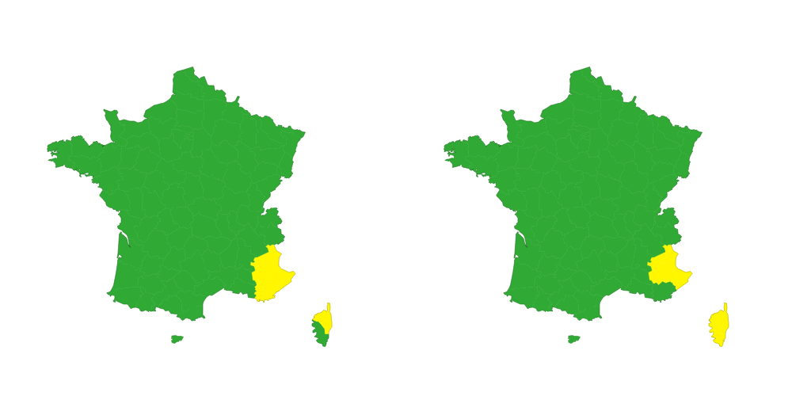

<p align="center">
  <a href="https://maif.github.io/meteole"></a>
</p>
<p align="center">
    <em>Easy access to Météo-France weather models and data</em>
</p>
<p align="center">
  
  
  
  
  
</p>

---

**Documentation:** [https://pages.github.com/MAIF/meteole/home](https://pages.github.com/MAIF/meteole/home)

**Repository:** [https://github.com/MAIF/meteole](https://github.com/MAIF/meteole)

---

## Overview

**Meteole** provides utilities to facilitate data retrieval from the Météo-France APIs using Python. It specifically supports the AROME and ARPEGE forecast models and vigilance bulletins.

### Installation

```python
pip install meteole
```

## 🕐 Quickstart

### Obtain an API token or key

Create an account on [the Météo-France API portal](https://portail-api.meteofrance.fr/). Next, subscribe to the desired APIs (Arome, Arpege, etc.). Retrieve the API token (or key) by going to “Mes APIs” and then “Générer token”.

### 🌧️ AROME, ARPEGE

The flagship weather forecasting models of Météo-France are accessible via the Météo-France APIs.

| Characteristics  | AROME                | ARPEGE               |
|------------------|----------------------|----------------------|
| Resolution       | 1.3 km               | 10 km                |
| Update Frequency | Every 3 hours        | Every 6 hours        |
| Forecast Range   | Up to 51 hours       | Up to 114 hours      |

```python
from meteole import AromeForecast

arome_forecast = AromeForecast(application_id=APPLICATION_ID)  # APPLICATION_ID found on portail.meteo-france.Fr

# Let's look at the latest wind gusts
indicator = 'V_COMPONENT_OF_WIND_GUST__SPECIFIC_HEIGHT_LEVEL_ABOVE_GROUND'

# Or check any other indicator in the list
print(arome_forecast.INDICATORS)

# Get the latest MeteoFrance forecasts concerning this indicator
# (All default parameters are printed to make sure you are in control)
df_arome = arome_forecast.get_coverage(indicator)

# default height doesn't suit you? change it easily
df_arome = arome_forecast.get_coverage(indicator, height=10)
```

### ⚠️ VIGILANCE METEO FRANCE

Meteo France offers a vigilance bulletin that provides nationwide predictions of potential weather risks.

For data usage, access the predicted phenomena to trigger modeling based on the forecasts.

```python
from meteole import Vigilance

vigi = Vigilance(application_id=APPLICATION_ID)

df_phenomenon, df_timelaps = vigi.get_phenomenon()

textes_vigilance = vigi.get_bulletin()

vigi.get_vignette()
```



To have more documentation from MeteoFrance in Vigilance Bulletin :
- [Meteo France Documentation](https://donneespubliques.meteofrance.fr/?fond=produit&id_produit=305&id_rubrique=50)

## Contributing

Contributions are *very* welcome!

If you see an issue that you'd like to see fixed, the best way to make it happen is to help out by submitting a pull request implementing it.

Refer to the [CONTRIBUTING.md](./CONTRIBUTING.md) file for more details about the workflow,
and general hints on how to prepare your pull request. You can also ask for clarifications or guidance in GitHub issues directly.

## License

This project is Open Source and available under the Apache 2 License.

[](https://www.maif.fr/)
